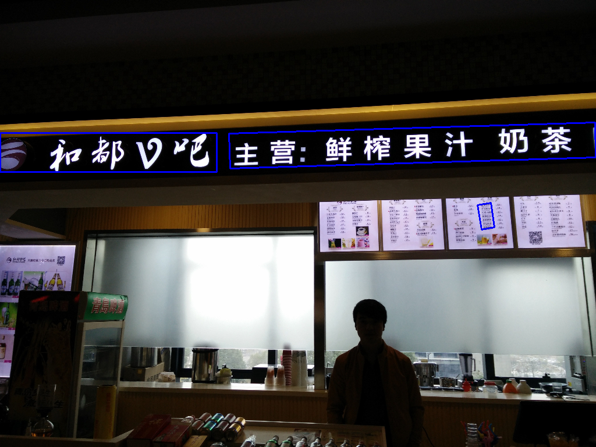
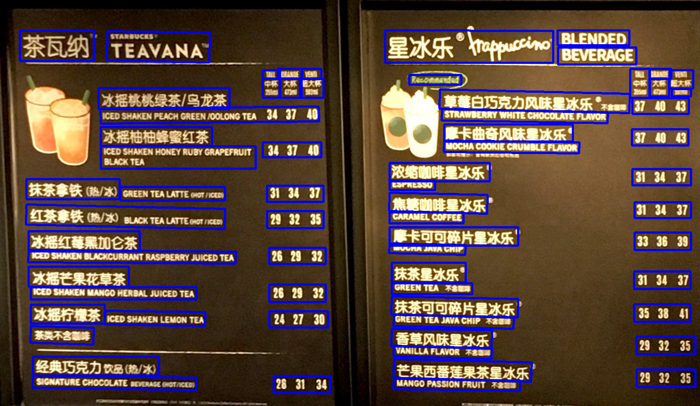
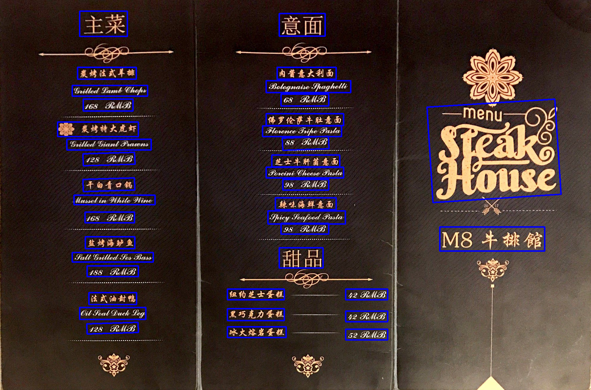
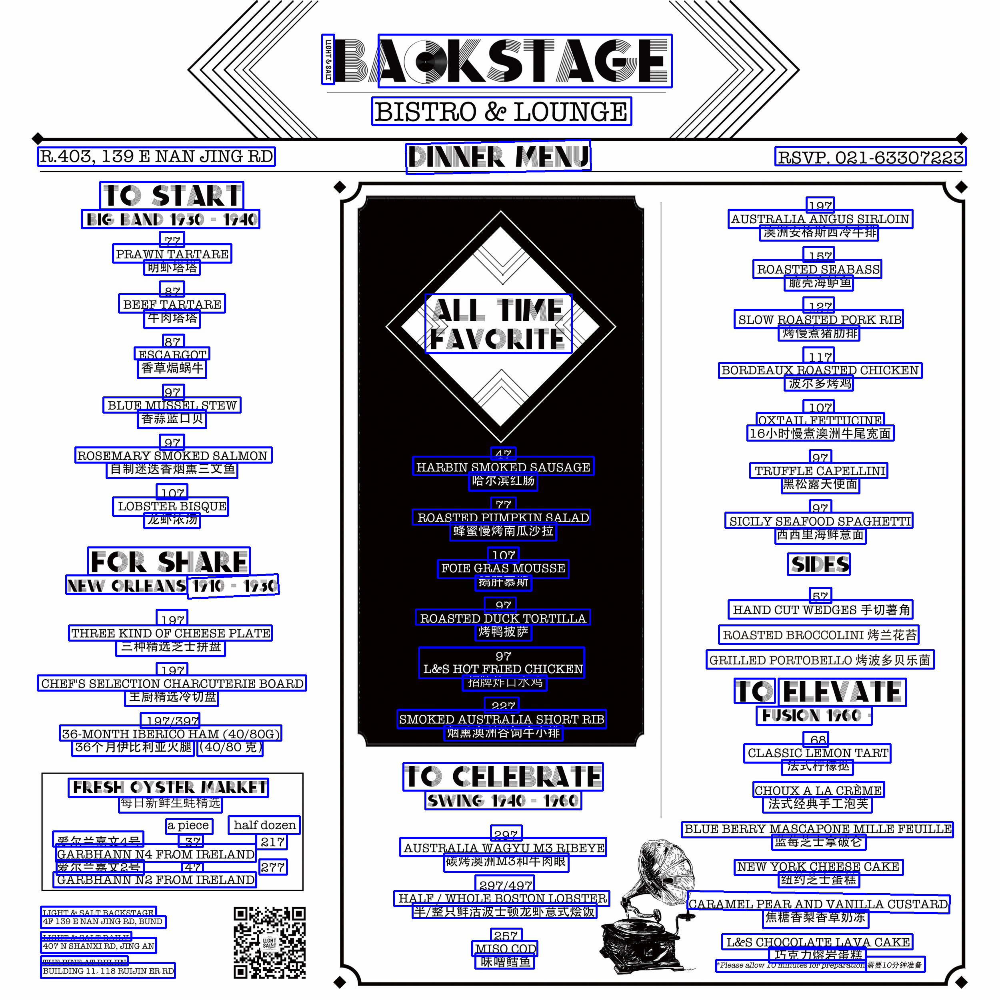

# Scene Text Detection by Pixel Link
## Detection on shopfront
<p align = 'center'>


<a href = 'samples/image2.png'></a>
</p>

## Detection on menu
<p align = 'center'>


<a href = 'samples/image7.png'></a>
</p>

Implementation for [PixelLink: Detecting Scene Text via Instance Segmentation](https://arxiv.org/abs/1801.01315), by Dan Deng, Haifeng Liu, Xuelong Li, and Deng Cai.

# Installation
## Clone the repo
```
git clone git@github.com:luoweimeng/pixel_link.git
```

## Prerequisites
* Python 2.7
* Tensorflow-gpu >= 1.1
* opencv2
* setproctitle
* matplotlib

Anaconda is recommended to for an easier installation:

1. Install [Anaconda](https://anaconda.org/)
2. Create and activate the required virtual environment by:
```
conda env create --file pixel_link_env.txt
source activate pixel_link
```

# Testing

## Test on any images
```
import matplotlib.pyplot as plt
import pixellink

# Load the image
pl = pixellink.pixelLinkDetector("/Users/luoweimeng/Code/data/test/40.jpg")

# output bounding boxes, (x1, y1, x2, y2, x3, y3, x4, y4) top_left、top_right、bottom_left,bottom_right
pl.detect()

# output pixel score
pixel_score = pl.draw_pixel_score()
plt.imshow(pixel_score, cmap='gray')

# output link score 0:top_left 1:top 2:top_right 3:left 4:right 5:bottom_left 6:bottom 7:bottem_right
link_score = pl.draw_link_score(6)
plt.imshow(link_score, cmap='gray')

# drow the bounding boxes on the original image
plt.imshow(pl.draw_bbox())
```

# Training
## Converting the dataset to tfrecords files
Scripts for converting ICDAR2017 / ICDAR2015 and SynthText datasets have been provided in the `datasets` directory.
 It not hard to write a converting script  for your own dataset.

## Train your own model

```
python train_pixel_link.py \
            --train_dir=/workdir/chengyuming/pixel_link/train/ic17_whole \
            --num_gpus=1 \
            --learning_rate=1e-3\
            --gpu_memory_fraction=-1 \
            --train_image_width=512 \
            --train_image_height=512 \
            --batch_size=16 \
            --dataset_dir=/workdir/chengyuming/dataset/pixel_link/ICDAR \
            --dataset_name=icdar2017 \
            --dataset_split_name=train \
            --max_number_of_steps=200000\
            --checkpoint_path=/workdir/chengyuming/pixel_link/train/ic17/model.ckpt-151160 \
            --using_moving_average=1
```
